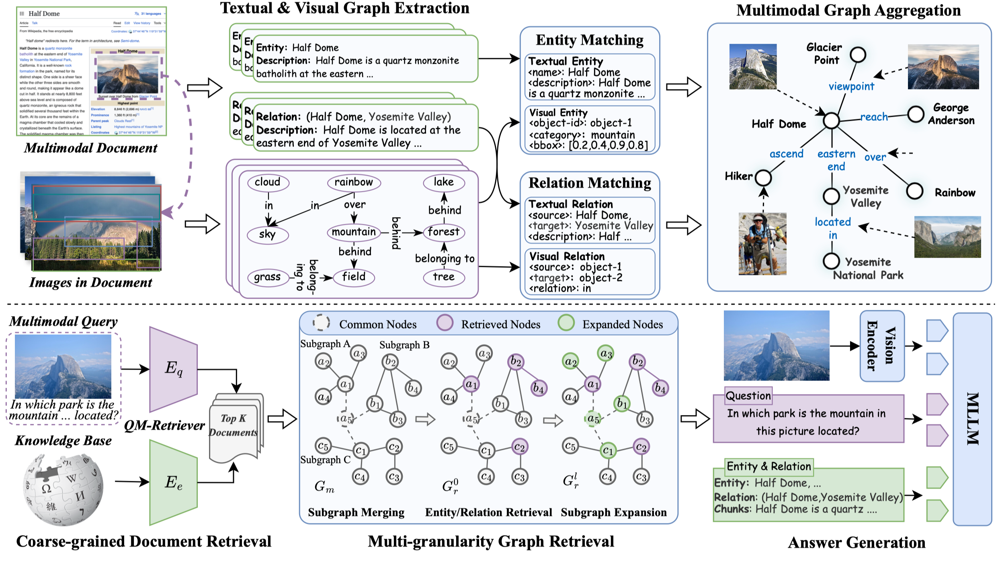

# mKG-RAG: Leveraging Multimodal Knowledge Graphs in Retrieval-Augmented Generation for Knowledge-intensive VQA

<p align="center">
  <a href="https://arxiv.org/abs/2508.05318"></a>
  <a href="https://creativecommons.org/licenses/by/4.0/"></a>
</p>

mKG-RAG constructs and retrieves from multimodal knowledge graphs to support knowledge-intensive VQA. The framework leverages MLLM-driven graph extraction and vision-text matching to distill semantically consistent, modalitycomplementary entities and relations from multimodal documents, constructing high-quality multimodal KGs as structured knowledge representations. Furthermore, a dual-stage retrieval strategy equipped with a query-aware multimodal retriever is introduced to improve retrieval efficiency while progressively refining precision.



## Setup

```bash
conda create -n mkg-rag python=3.10
conda activate mkg-rag
pip install -r requirements.txt
```

## Dataset
**The process of dataset preparation will be updated soon.**


```bash
# Download the images in the database
python -m scripts.download_kbimage download \
    --kb_file data/encyclopedic-vqa/encyclopedic_kb_wiki_all.jsonl

# [Optional] Resize the images
python -m scripts.download_kbimage resize \
    --img_dir data/encyclopedic-vqa/kb_images_ori/all \
    --resized_img_dir data/encyclopedic-vqa/kb_images_640/all
```

## EGTR
Download the weights from [here](https://github.com/naver-ai/egtr#model-train) and place them in the `weights` directory.

```bash
mkdir -p weights/egtr
cd weights/egtr
wget `the-url-of-the-weights`
tar -zxvf egtr_vg.tar.gz
```

## MMKG Construction 

1. Generate the scene graphs for the images in the dataset or database.
```bash
bash scripts/egtr_infer.sh 
```

**Note**: transformers==4.49.0 is required by egtr.

2. Build the multimodal knowledge graph.
```bash
python -m rag.mmkg \
    --mode build \
    --device 0 \
    --working_dir data/encyclopedic-vqa/envqa_test/mkg-rag \
    --scene_graph_dir data/encyclopedic-vqa/envqa_test/scene_graph \
    --kb_file data/encyclopedic-vqa/encyclopedic_kb_wiki_all.jsonl
```

3. Post-process the multimodal knowledge graph.
```bash
python -m rag.mmkg \
    --mode "post_process" \
    --device "0" \
    --working_dir data/encyclopedic-vqa/envqa_test/mkg-rag \
    --scene_graph_dir data/encyclopedic-vqa/envqa_test/scene_graph \
    --kb_file data/encyclopedic-vqa/encyclopedic_kb_wiki_all.jsonl
```


## MMKG Retrieval
1. Build the index for Document-level retrieval.
```bash
python main.py \
   --step index \
   --device 0 \
   --dataset envqa \
   --retriever embed
```

2. Document-level retrieval.
```bash
python main.py \
    --step retrieve \
    --device 0 \
    --dataset envqa \
    --split test  \
    --retriever embed \
    --num_workers 8 \
    --batch_size 32
```

3. Graph-level retrieval.

```bash
python main.py \
    --step retrieve \
    --device 0 \
    --dataset envqa \
    --split test \
    --retriever mmrag \
    --num_workers 8 \
    --batch_size 32
```

4. Generate the VQA answers.
```bash
python main.py \
    --step vqa \
    --device 0 \
    --model_family qwen \
    --dataset envqa \
    --batch_size 4 \
    --split test \
    --retriever mmrag
```

5. Evaluate the VQA answers.
```bash
python main.py \
    --step evaluate \
    --device 0 \
    --model_family qwen \
    --dataset envqa \
    --split test \
    --retriever mmrag
```

## Reference
- [LLaVA from haotian-liu](https://github.com/haotian-liu/LLaVA)
- [EGTR from naver-ai](https://github.com/naver-ai/egtr)
- [VQA from GT-Vision-Lab](https://github.com/GT-Vision-Lab/VQA)
- [LightRAG from HKUDS](https://github.com/hkuds/lightrag)

